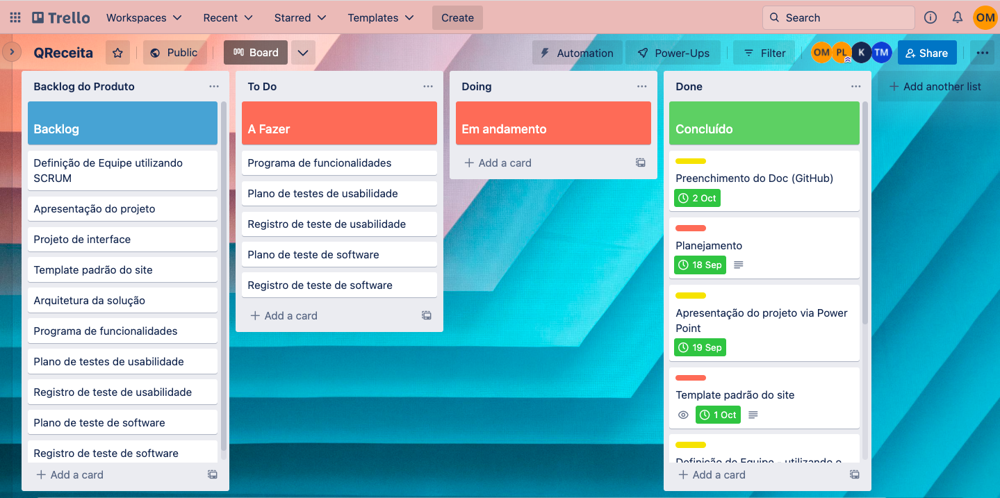

# Metodologia

Pré-requisitos: <a href="2-Especificação do Projeto.md"> Documentação de Especificação</a>

A metodologia contempla as definições de ferramentas utilizadas pela equipe tanto para a manutenção dos códigos e demais artefatos quanto para a organização do time na execução das tarefas do projeto.

### Relação de Ambientes de Trabalho

Os artefatos do projeto são desenvolvidos a partir de diversas plataformas e a relação dos ambientes com seu respectivo propósito é apresentada na tabela que se segue.

|Ambiente| Plataforma|Link de Acesso                 |
|--------------------|------------------------------------|----------------------------------------|
|Repositório de Código Fonte | GitHub  | https://github.com/ICEI-PUC-Minas-PMV-ADS/pmv-ads-2022-2-e1-proj-web-t4-qreceita |
|Documentos do Projeto | Google Drive |  https://docs.google.com/document/d/1F72R13i_gHCGo0da6U-IYfqREpw-XwJuciUmZfAD4lk/edit#
|Projeto de Interface e Wireframes | MarvelApp| https://marvelapp.com/project/6437467  |
|Gerenciamento do Projeto  | Trello | https://trello.com/b/6ivzp1p6/qreceita  |

### Gerenciamento do Projeto

A equipe utiliza metodologias ágeis, tendo escolhido o Scrum como base para definição do processo de desenvolvimento.

### Divisão de Papéis

A equipe está organizada da seguinte maneira:

●  	Scrum Master: Thais Menezes

●  	Product Owner: Paula Martins

●  	Equipe de Desenvolvimento: Kevin Muramoto

●  	Equipe de Design: Odair Marra
 
 
Para organização e distribuição das tarefas do projeto, a equipe está utilizando o Trello estruturado com as seguintes listas:
 
●  	Backlog: recebe as tarefas a serem trabalhadas e representa o Product Backlog. Todas as atividades identificadas no decorrer do projeto também devem ser incorporadas a esta lista.

●  	To Do: Esta lista representa o Sprint Backlog. Este é o Sprint atual que estamos trabalhando.

●  	Doing: Quando uma tarefa tiver sido iniciada, ela é movida para cá.

●  	Done: nesta lista são colocadas as tarefas que passaram pelos testes e controle de qualidade e estão prontos para serem entregues ao usuário. Não há mais edições ou revisões necessárias, ele está agendado e pronto para a ação.
 
O quadro kanban do grupo desenvolvido na ferramenta de gerenciamento de projetos está disponível através da Trello e é apresentado, no estado atual, na Figura 1.

