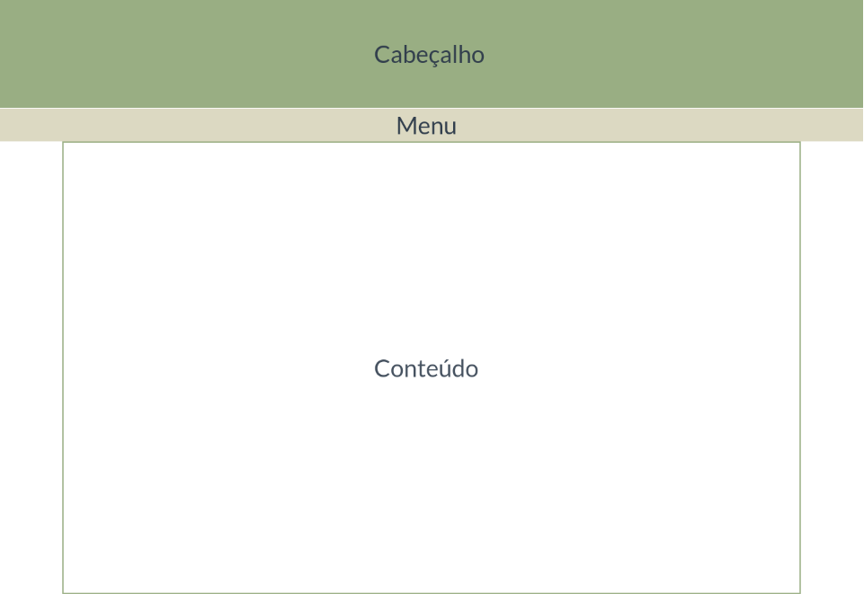
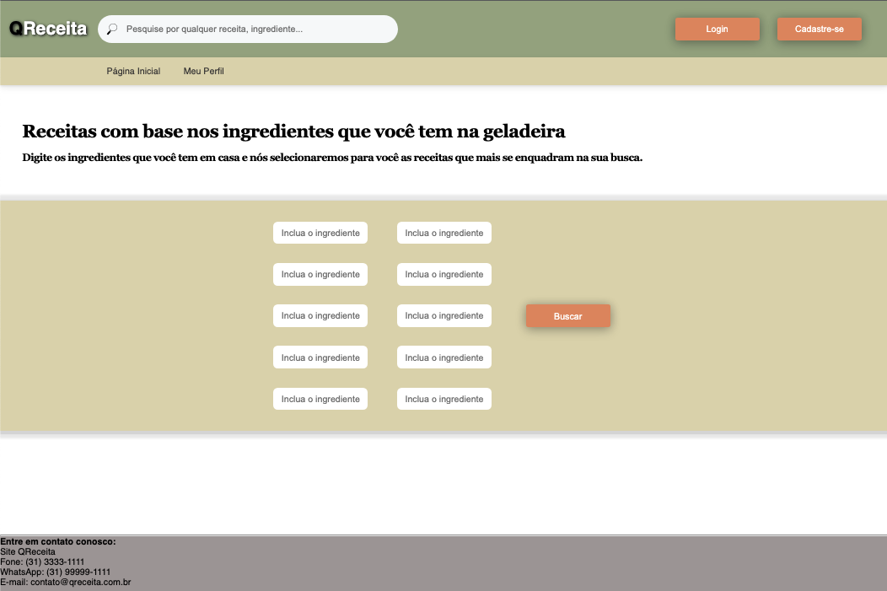

# Template padrão do site

O padrão de layout a ser utilizado pelo site tem correspondência ao projeto de Interface elaborado anteriormente, conforme Figura 3.

  

Template Padrão do Site

O template criado está disponível no site https://github.com/ICEI-PUC-Minas-PMV-ADS/pmv-ads-2022-2-e1-proj-web-t4-qreceita/tree/main/src  e é composto pelos seguintes layouts:

●  	Cabeçalho

●  	Menu

●  	Conteúdo

## Tela Principal

Tela que abrange todas as visualizações iniciais do site e as barras de opções para que o usuário possa acrescentar os ingredientes que desejar.

  

Tela Página Inicial

