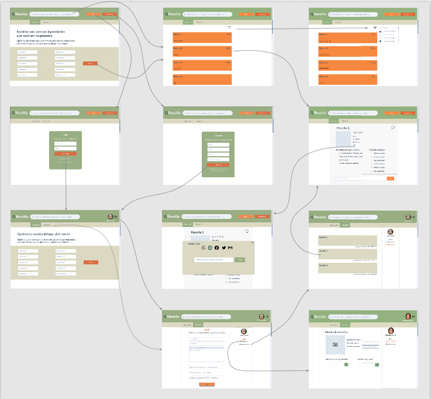

# Template padrão do site

Pré-requisitos: <a href="2-Especificação do Projeto.md"> Especificação do Projeto</a>, <a href="3-Projeto de Interface.md"> Projeto de Interface</a>, <a href="4-Metodologia.md"> Metodologia</a>

<!--FAZER AJUSTES COM OS DADOS DA UNIDADE 6-->

# Projeto de Interface

Dentre as preocupações para a montagem da interface do sistema, estamos estabelecendo foco em questões como agilidade, acessibilidade e usabilidade. Desta forma, o projeto tem uma identidade visual padronizada em todas as telas que são projetadas para funcionamento em desktops e dispositivos móveis.

## User Flow

O diagrama apresentado na Figura 2 mostra o fluxo de interação do usuário pelas telas do sistema. Cada uma das telas deste fluxo é detalhada na seção de Wireframes que se segue. Para visualizar o wireframe interativo, acesse o <a href="https://marvelapp.com/project/6437467">Ambiente MarvelApp do projeto</a>

  

Figura 2 - Fluxo de telas do usuário

## Wireframes

Conforme fluxo de telas do projeto, apresentado no item anterior, as telas do sistema são apresentadas em detalhes nos itens que se seguem. As telas do sistema apresentam uma estrutura comum que é apresentada na Figura 3. Nesta estrutura, existem 3 grandes blocos, descritos a seguir. São eles:

  ● Cabeçalho - local onde são dispostos elementos fixos de identidade (logo), barra de pesquisa geral e botões de Login e Cadastre-se;

  ● Menu - neste bloco estão dispostos a estrutura de navegação principal do site (menu da aplicação);

  ● Conteúdo - apresenta o conteúdo da tela em questão;

  

Figura 3 - Estrutura padrão do site

### Tela - Página Inicial
<!--FINALIZAR OS AJUSTES INICIADOS...-->

Layout padrão do site (HTML e CSS) que será utilizado em todas as páginas com a definição de identidade visual, aspectos de responsividade e iconografia.

> **Links Úteis**:
>
> - [CSS Website Layout (W3Schools)](https://www.w3schools.com/css/css_website_layout.asp)
> - [Website Page Layouts](http://www.cellbiol.com/bioinformatics_web_development/chapter-3-your-first-web-page-learning-html-and-css/website-page-layouts/)
> - [Perfect Liquid Layout](https://matthewjamestaylor.com/perfect-liquid-layouts)
> - [How and Why Icons Improve Your Web Design](https://usabilla.com/blog/how-and-why-icons-improve-you-web-design/)
