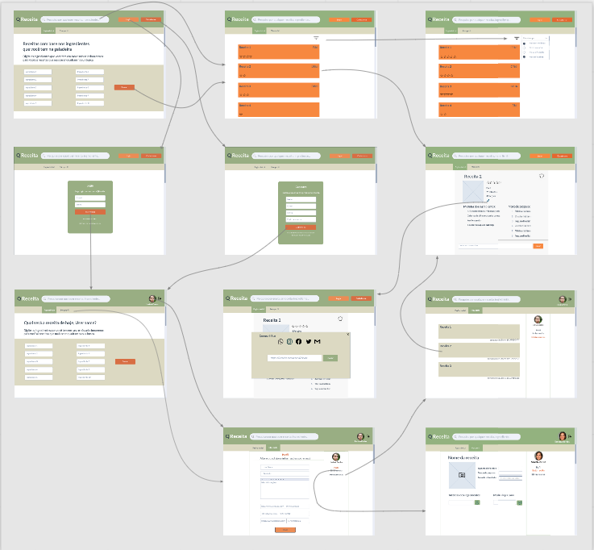

# Funcionalidade do Sistema (Telas)

Nesta seção são apresentadas as telas desenvolvidas para cada uma das funcionalidades do sistema. O respectivo endereço (URL) e outras orientações de acesso são apresentadas na sequência.

## Pesquisa de Receitas (RF-05)

A tela principal do sistema apresenta as barras de pesquisa para que o usuário possa informar quais os ingredientes tem disponível. A tela possui também a opção de login, para usuários já cadastrados, e cadastro, para usuários que ainda não estejam cadastrados. As receitas são armazenadas no LocalStorage com estruturas de dados baseada em JSON. Um exemplo da tela é apresentada na Figura 16.

  

Template Padrão do Site

### Requisitos atendidos

●  	RF-05 

### Artefatos da funcionalidade

•	index.html
•	dbfake_search.js
•	footer_style.css
•	header_style.css
•	content_style.css

### Instruções de Acesso

1. Insira nas barras de pesquisas os ingredientes que estiverem disponíveis;
2. Após, clique em buscar.
3. Para buscas de receitas mais abrangentes, utilize a barra de pesquisa disposta no cabeçalho da Página Inicial e pesquisar, clicando no botão de Lupa ao lado esquerdo.
