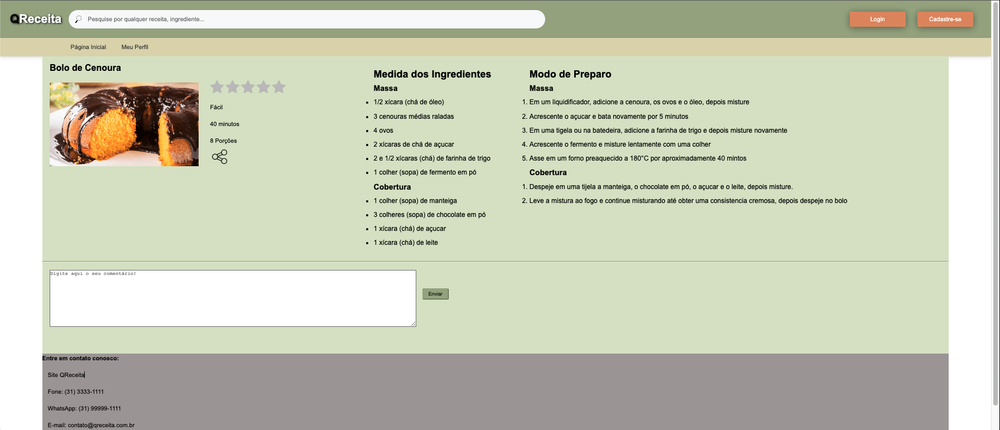

# Funcionalidade do Sistema (Telas)

Nesta seção são apresentadas as telas desenvolvidas para cada uma das funcionalidades do sistema. O respectivo endereço (URL) e outras orientações de acesso são apresentadas na sequência.

## Pesquisa de Receitas (RF-05)

A tela principal do sistema apresenta as barras de pesquisa para que o usuário possa informar quais os ingredientes tem disponível. A tela possui também a opção de login, para usuários já cadastrados, e cadastro, para usuários que ainda não estejam cadastrados. As receitas são armazenadas no LocalStorage com estruturas de dados baseada em JSON. Um exemplo da tela é apresentada na Figura 16.

  

Teste Tela Inicial

### Requisitos atendidos

●  	RF-05 

### Artefatos da funcionalidade

•	index.html

•	dbfake_search.js

•	footer_style.css

•	header_style.css

•	content_style.css

### Instruções de Acesso

1. Insira nas barras de pesquisas os ingredientes que estiverem disponíveis;
2. Após, clique em buscar.
3. Para buscas de receitas mais abrangentes, utilize a barra de pesquisa disposta no cabeçalho da Página Inicial e pesquisar, clicando no botão de Lupa ao lado esquerdo.

## Fazer Cadastro (RF-01)

A tela de efetuar cadastro permite ao usuário se cadastrar no site para que possa ter acesso a outras funcionalidades como salvar suas receitas favoritas, incluir receitas e etc.

  

Figura 18: Cadastra-se

### Requisitos atendidos

●  	RF-01

### Artefatos da funcionalidade

●  	cadastre-se.html

●  	forms-val.js

●  	cadastre-se_style.css

### Estrutura de Dados

{usuarios: [{

		“id”: 1,
		
    		"login": "admin",
		
	 	"senha": "123",
		
    		"nome": "Administrador do Sistema",
		
    		"email": "admin@abc.com"
		
    	}]}
 
 ### Instruções de acesso
 
1. Clique no botão no canto superior direito da tela indicado como Cadastre-se
2. Preencha as informações de acordo com o solicitado pelo site (Nome, Email, Senha e Confirme Senha)
3. Clique em Cadastre-se

## Fazer Login (RF-01)

A tela de login permite ao usuário já cadastrado ter acesso a suas informações pessoais e a funcionalidades do site disponíveis apenas para os que já possuam login.

  

Figura 19: Login

### Requisitos atendidos

●  	RF-01

### Artefatos da funcionalidade

●  	login.html

●  	forms-val.js

●  	login_style.css

## Instruções de acesso

1. Clique no botão no canto superior direito da tela indicado como Login;
2. Preencha as informações de acordo com o solicitado pelo site (Email e Senha);
3. Clique em Fazer login.

## Receitas Encontradas e Filtro de Receitas (RF-02, RF-03 e RF-07)

Após efetuar a busca na Página inicial o usuário será redirecionado para a Tela de Receitas Encontradas. Nela, ficará disponível todas as receitas localizadas pelo site de acordo com os ingredientes informados pelo usuário. Logo ao lado da primeira opção informada há um filtro, no qual ele poderá restringir suas opções de visualização de acordo com as opções: Receitas mais fáceis, Receitas mais difíceis, Receitas mais avaliadas e Receitas menos avaliadas.

  

Figura 20: Receitas Encontradas e Filtro de Receitas

### Requisitos atendidos

●  	RF-02,  RF-03 e RF-07
 

### Artefatos da funcionalidade

●  	receitas_encontradas.html

●  	receitas_encontradas.css

### Estrutura de Dados

### Instruções de acesso

1. Clique em uma das receitas encontradas 
2. Caso deseje filtrar as opções, clicar no botão ao lado da primeira receita informada e selecionar um dos filtros.
3. A página será recarregada de acordo com a opção de filtragem escolhida.

## Receita Escolhida (RF-06 e RF-09)

Na tela Receita Escolhida, o usuário irá visualizar informações relevantes como o número de porções, tempo de preparo, grau de dificuldade e o detalhamento da receita escolhida, com ingredientes e o modo de preparo. Há também um ícone para o compartilhamento da receita, avaliá-la utilizando os ícones de estrelas e a opção de adicionar um comentário além de visualizar comentários de outros usuários.

  

Figura 21: Receita Escolhida

### Requisitos atendidos

●  	RF-06 e RF-09

### Artefatos da funcionalidade

●  	receita-escolhida.html

●  	forms-val.js

●  	receita-escolhida.css

### Estrutura de Dados
 

 
### Instruções de acesso

1. Clicar na receita escolhida na página anterior;
2. Abrirá uma nova página com todo o detalhamento da receita;
3. Para compartilhar a receita o usuário deverá clicar no ícone de compartilhamento.
4. Para enviar e/ou ler comentários o usuário deverá descer até o rodapé da página onde fica localizado uma caixa de texto para comentários e os comentários anteriores.
5. Para avaliar a receita, o usuário deverá contar com o sistema de estrelas, clicando em cada uma de acordo com o favoritismo por ela.

## Compartilhamento de Receitas (RF-10)

Desejando o usuário compartilhar a receita escolhida, deverá clicar no ícone de compartilhamento localizado na tela da receita. O mesmo será redirecionado a uma nova tela, onde deverá copiar o link do site e selecionar uma das redes sociais informadas para finalizar o compartilhamento.

  

Figura 22: Compartilhamento de Receitas

### Requisitos atendidos

●  	RF-10

### Artefatos da funcionalidade

●  	compartilhamento-da-receita.html

●  	compartilhamento-da-receita.css

### Estrutura de Dados
 

 
### Instruções de acesso

1. Após clicar no botão de compartilhamento da Receita Escolhida, clicar no botão Copiar para a url da página ser selecionada;
2. Clicar no ícone de uma das redes sociais para ser redirecionado para a mesma e compartilhar o link.

## Tela do Usuário logado (RF-03)

Ao efetuar o cadastro, o usuário deixará de visualizar a Tela Inicial original e passará a ter sua tela personalizada com sua foto no canto superior direito e seu nome logo acima das barras de pesquisa.

  

Figura 23: Usuário Logado

### Requisitos atendidos

●  	RF-03

### Artefatos da funcionalidade

●  	user-logado.html
●  	user-logado.css

Estrutura de Dados
{usuarios: [{

		“id”: 1,
		
    		"login": "admin",
		
	 	"senha": "123",
		
    		"nome": "Administrador do Sistema",
		
    		"email": "admin@abc.com"
		
    	}]}

 
### Instruções de acesso

1. Insira nas barras de pesquisas os ingredientes que estiverem disponíveis;
2. Após, clique em buscar.
3. Para buscas de receitas mais abrangentes, utilize a barra de pesquisa disposta no cabeçalho da Página Inicial e pesquisar, clicando no botão de Lupa ao lado esquerdo.
4. Para sair da área logada, clicar no ícone de sair, ao lado da foto, no canto superior direito.

## Tela do Usuário - Meu Perfil (RF-01)

Na barra de navegação da Tela Inicial, a opção Perfil leva o usuário a uma tela com informações pessoais a serem preenchidas por ele como nome, sua profissão, informações relevantes e suas redes sociais.

  

Figura 24: Meu Perfil

### Requisitos atendidos

●  	RF-01

### Artefatos da funcionalidade

●  	meu_perfil.html

●  	meu_perfil-style.css

### Estrutura de Dados
 

 
### Instruções de acesso

1. Na barra de navegação clicar na opção Meu Perfil;
2. No menu Meu perfil, preencher as informações solicitadas;
3. Clicar em salvar.

## Tela de Inclusão de Receitas (RF-08)

Logado ao site, o usuário poderá efetuar a inclusão de novas receitas, aumentando o banco de receitas da plataforma. Essa opção, fica disponível no Meu perfil na barra lateral direita.

  

Figura 25: Incluir Receitas

### Requisitos atendidos

●  	RF-08

### Artefatos da funcionalidade

●  	enviar_receitas.html

●  	enviar_receitas-style.css

### Estrutura de Dados
 

 
### Instruções de acesso

1. Após abrir o Meu perfil, clicar na opção Incluir Receita na barra lateral direita;
2. Preencher todas as informações sobre os ingredientes, o modo de preparo, a quantidade de porções, o nível de dificuldade e o tempo de preparo;
3. A cada novo ingrediente/modo de preparo, clicar no ícone de + ao lado da barra de digitação para adicionar um novo campo abaixo do primeiro.
4. Clicar na área em branco para adicionar uma foto do prato.
5. Ao finalizar, clicar em salvar.

## Tela de Receitas Favoritas (RF-04)

Logado ao site, o usuário poderá salvar suas receitas favoritas. Essa receitas ficaram disponíveis dentro do Perfil na opção Minhas Receitas.

  

Figura 26: Receitas Favoritas

### Requisitos atendidos

●  	RF-04

### Artefatos da funcionalidade

●  	minhas_receitas.html

●  	minhas_receitas-style.css

### Estrutura de Dados
 

 
### Instruções de acesso

1. Após abrir o Meu perfil, clicar na opção Minhas Receitas na barra lateral direita;
2. Uma nova página será aberta com todas as receitas salvas pelo usuário;
3. Para visualizar uma delas basta clicar em cima de uma das opções.

